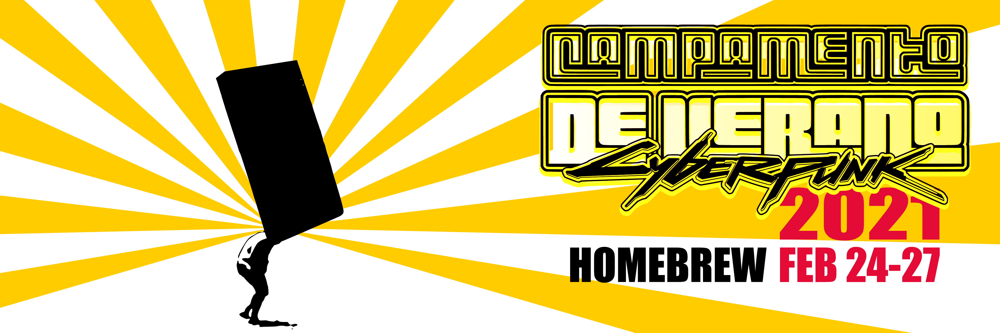
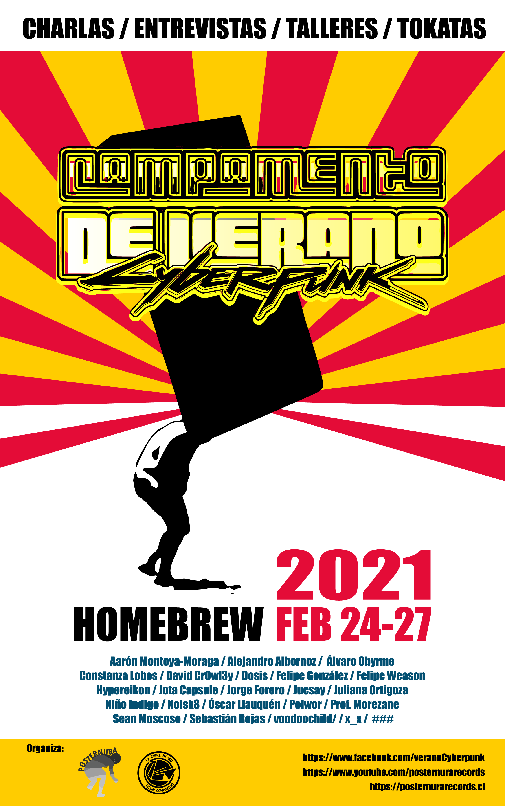
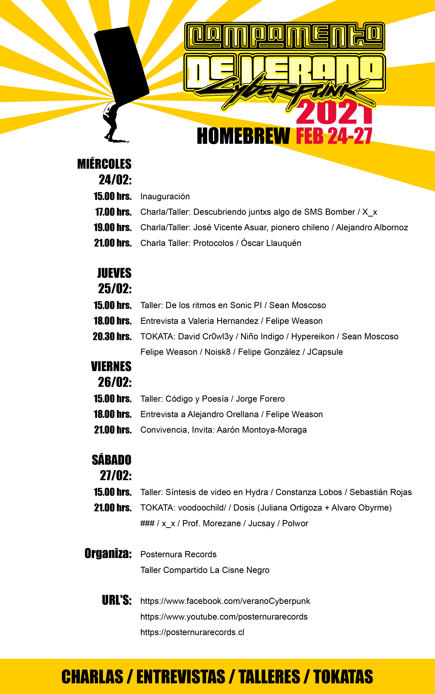

# Campamento de Verano Cyberpunk 2021
## Homebrew
### FEB 24-27
El Campamento Cyberpunk Posternura es un encuentro que se realiza anualmente desde el año 2019 en la ciudad de Valdivia. El espíritu que nos guía es el del libre encuentro entre artistas que trabajen los medios y la tecnología. Promoviendo prácticas éticas latinoamericanas de trabajo colaborativo. Durante el año 2020 el Campamento expandió sus prácticas para seguir desarrollando las colaboraciones, para ello fueron organizadas tocatas periódicas y entrevistas a artistas.

### Evento en FB: https://www.facebook.com/events/1090230341453153

- Miércoles 24/02
  - 15:00 Inauguración
  - 17:00 Charla Taller: Descubriendo juntxs algo de SMS Bomber / X_x 
    - Zoom: [uchile.zoom.us/j/88601243059?pwd=K3l1LzdmcU8rSk1VNGRub3dzRG5RUT09](https://uchile.zoom.us/j/88601243059?pwd=K3l1LzdmcU8rSk1VNGRub3dzRG5RUT09) 
    - Youtube: [youtu.be/lTX7umZvyNs](https://youtu.be/lTX7umZvyNs)
  - 19:00 Charla Taller: José Vicente Asuar, pionero chileno/ Alejandro Albornoz
    - Zoom: [reuna.zoom.us/j/85714670879?pwd=ZVJtdU02VlZlbStPQlFUd2s5bjVIZz09](https://reuna.zoom.us/j/85714670879?pwd=ZVJtdU02VlZlbStPQlFUd2s5bjVIZz09) 
    - Youtube: [https://youtu.be/iKXOYRHT3rM](https://youtu.be/iKXOYRHT3rM)
  - 21:00 Charla Taller : Protocolos / Oscar Llauquén
    - Zoom: [uchile.zoom.us/j/83636830489?pwd=Z3QzNXRtT0sxc3Ftd0U3Um5rRkdMdz09](https://uchile.zoom.us/j/83636830489?pwd=Z3QzNXRtT0sxc3Ftd0U3Um5rRkdMdz09)
    - Youtube: [https://youtu.be/D0lHox7RMaM](https://youtu.be/D0lHox7RMaM) 
- Jueves 25/02 
  - 15:00 Taller: de los ritmos en Sonic PI / Sean Moscoso
    - Zoom: [https://uchile.zoom.us/j/89483394039?pwd=aXJoM29oS2JXN3UyaFFVS2N0NFIrdz09](https://uchile.zoom.us/j/89483394039?pwd=aXJoM29oS2JXN3UyaFFVS2N0NFIrdz09)
    - Youtube: [https://youtu.be/aZoeU1lS9pc](https://youtu.be/aZoeU1lS9pc) 
  - 18:00 Entrevista a Valeria Hernández / Felipe Weason
    - Youtube: [https://youtu.be/WND35bOMqbI](https://youtu.be/WND35bOMqbI) 
  - 20:30 Tokata: David Cr0wl3y / Niñosindigo / Hypereikon / Sean Moscoso - Felipe Weason / Noisk8 / Felipe Gonzalez / JCapsule
    - Youtube: [https://youtu.be/nvXRFdmrHv0](https://youtu.be/nvXRFdmrHv0) 
- Viernes 26/02
  - 15:00 Taller: Codigo y Poesía / Jorge Forero
    - Zoom: [https://uchile.zoom.us/j/81267305877?pwd=WWtVQ0hKU3hBNmRuaGlKa2lWMEJtQT09](https://uchile.zoom.us/j/81267305877?pwd=WWtVQ0hKU3hBNmRuaGlKa2lWMEJtQT09)
  - 18:00 Entrevista a Alejandro Orellana / Felipe Weason
    - Youtube [link](https://youtu.be/_-cdguU-8-8) 
  - 21:00 Convivencia, Invita Aarón Montoya-Moraga
    - Zoom: [https://uchile.zoom.us/j/86505586639?pwd=MkFDa2t4N2tCc2YxcVBQUjZBK203dz09](https://uchile.zoom.us/j/86505586639?pwd=MkFDa2t4N2tCc2YxcVBQUjZBK203dz09)
- Sábado 27/02
  - 15:00 Taller : Síntesis de video en Hydra / Constanza - Sebastián Rojas
    - Zoom: [https://uchile.zoom.us/j/81810533907?pwd=S0pDdVgvWnlkTHFqZmhsVzBkcGlkUT09](https://uchile.zoom.us/j/81810533907?pwd=S0pDdVgvWnlkTHFqZmhsVzBkcGlkUT09)
  - 21:00 Tokata: voodoochild / Dosis ( Juliana Ortigoza + Alvaro Obyrme) / ### / x_x / Prof. Morezane / Jucsay / Polwor
    - Youtube: [https://youtu.be/iIG9Xp2CN4Q](https://youtu.be/iIG9Xp2CN4Q) 

Las charlas y tokatas serán transmitidas por nuestro canal de youtube:
https://www.youtube.com/posternurarecords y en nuestra pagina https://posternurarecords.cl
Los talleres tendrán cada uno un link abierto de acceso que estara disponible durante el día en de que se inicie.

- [Canal en Youtube](https://www.youtube.com/posternurarecords)
- [Campamento de Verano Cyberpunk en FB](https://www.facebook.com/veranoCyberpunk)
- [Posternura Records en FB](https://www.facebook.com/posternurarecords/)

